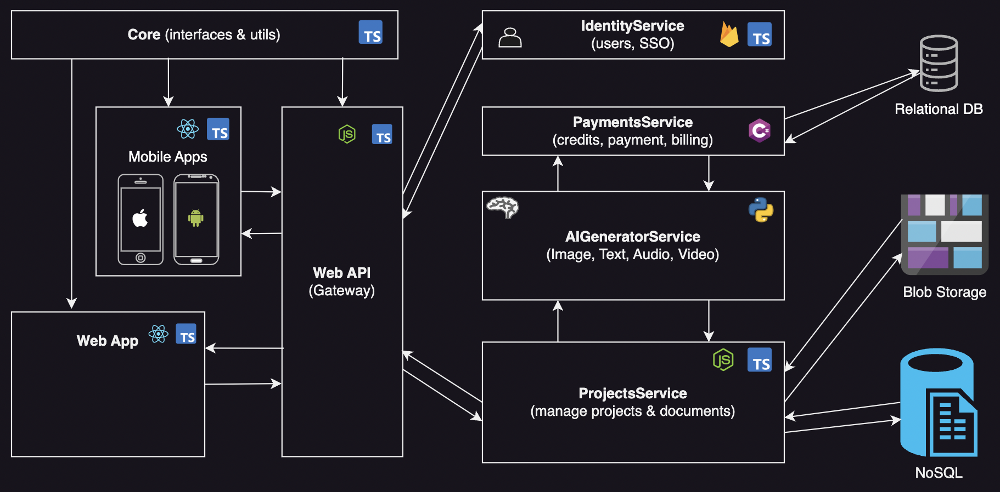
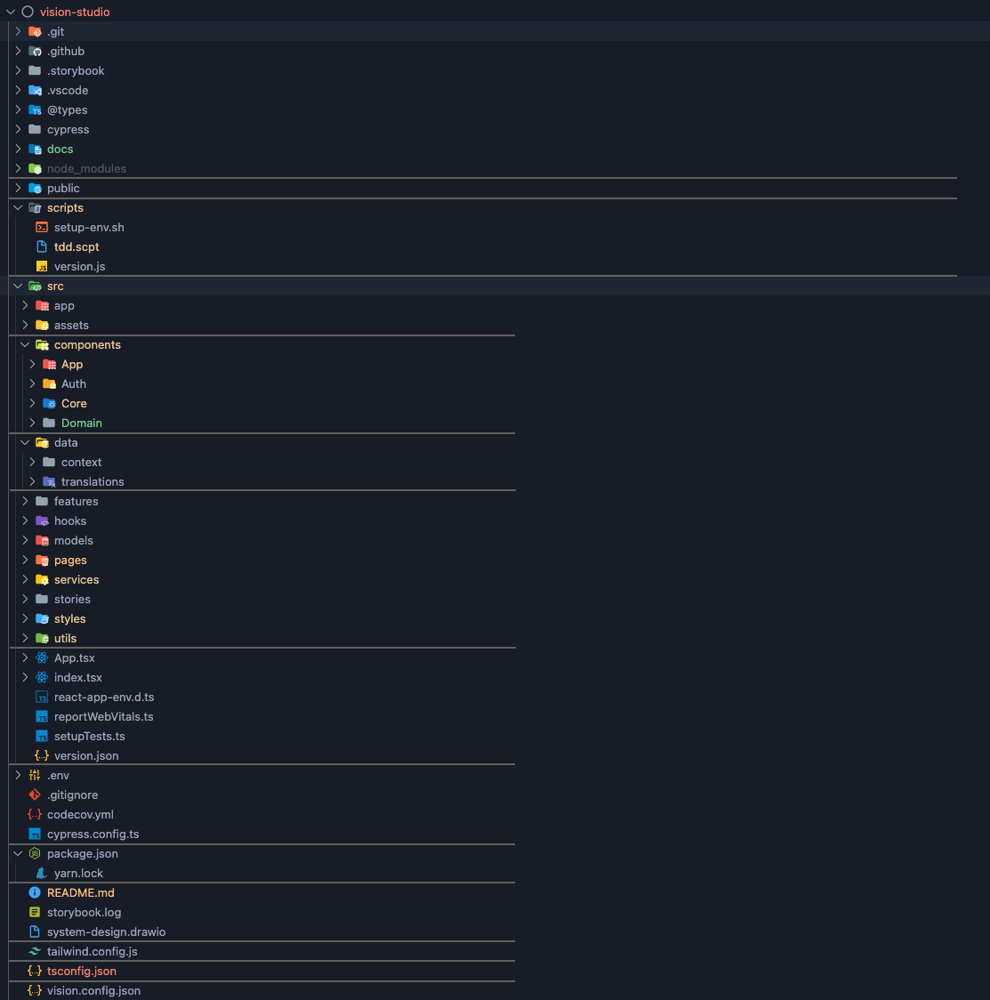
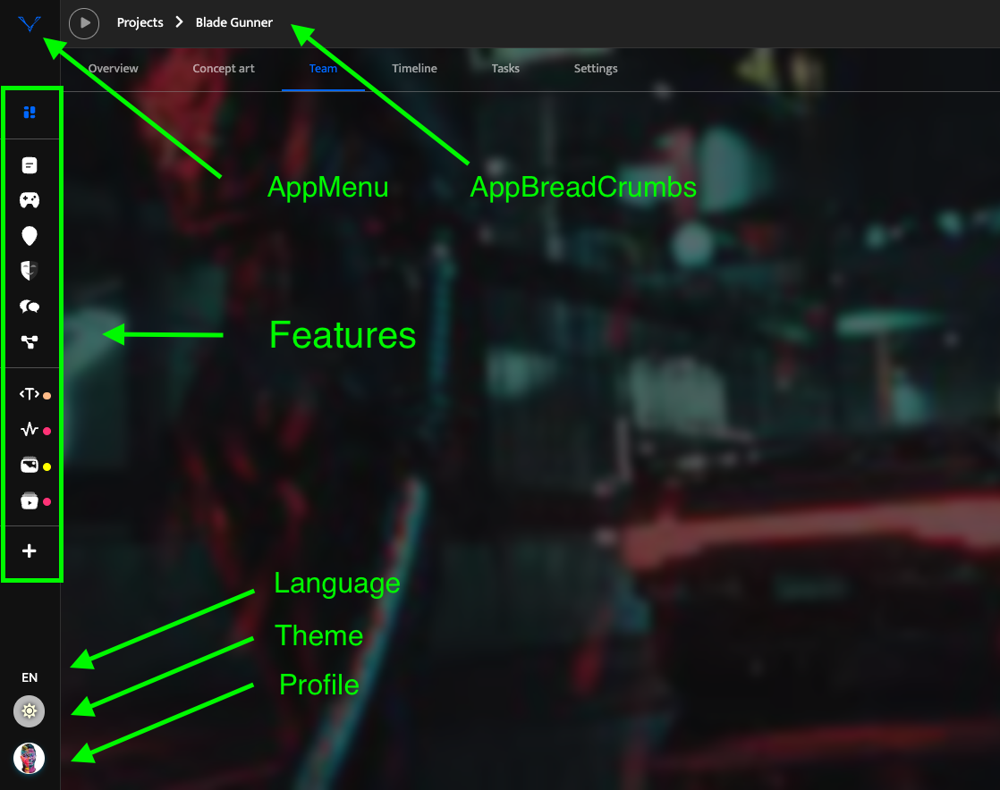
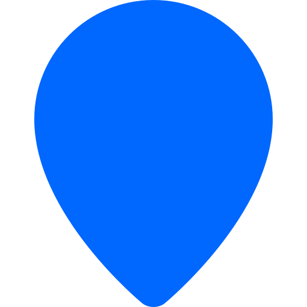
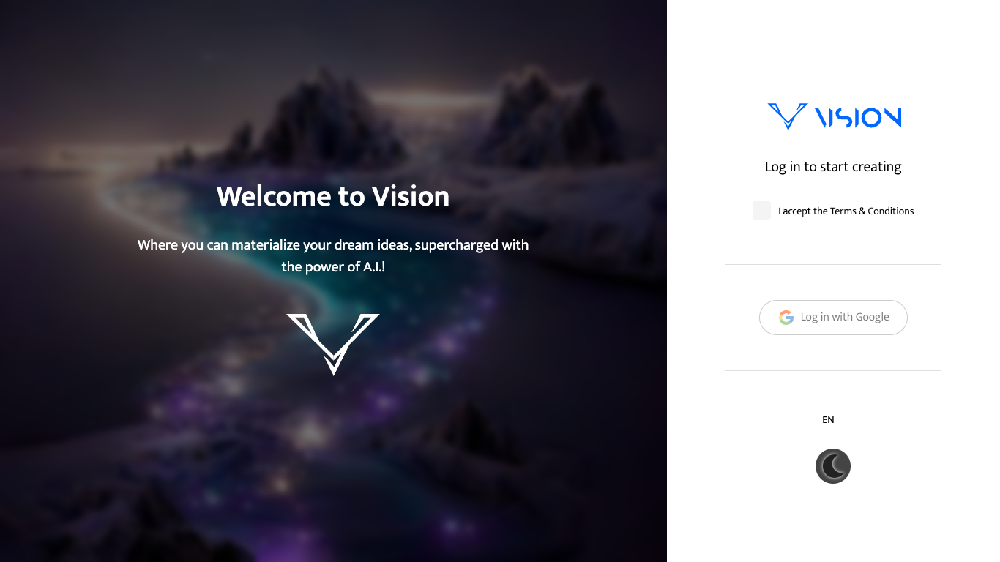
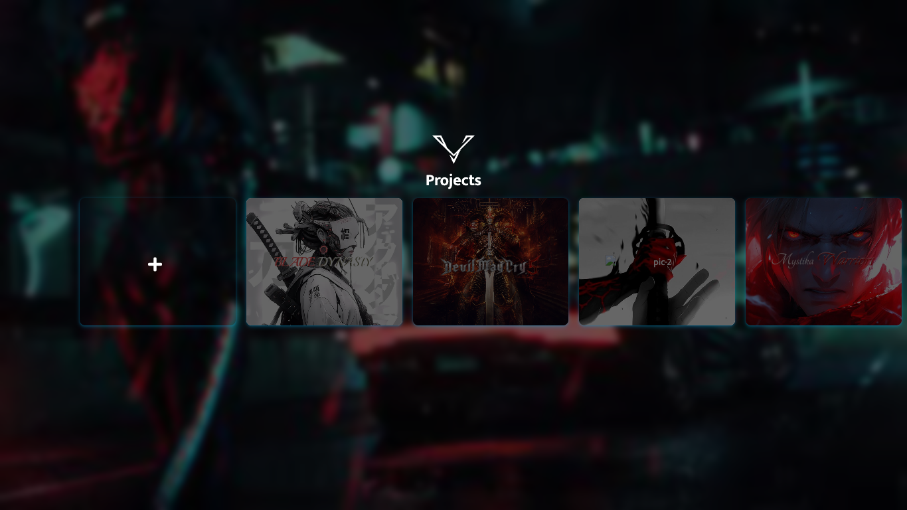
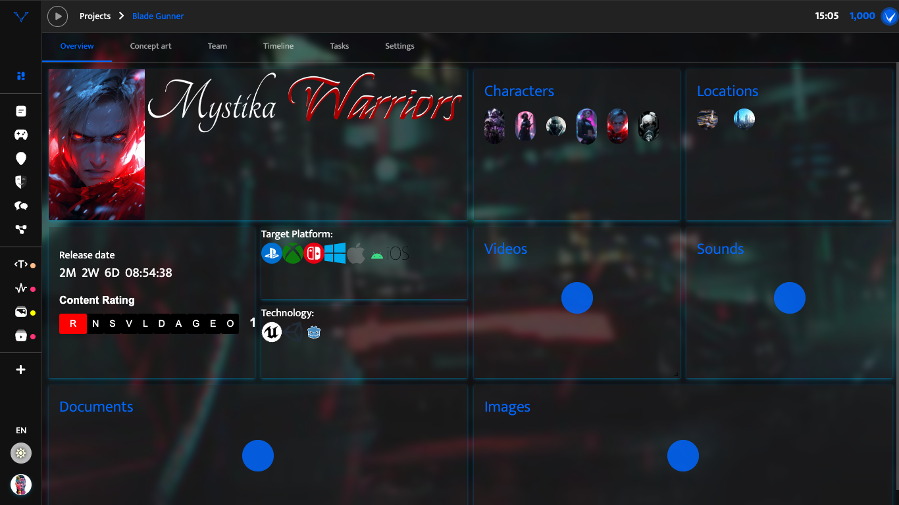
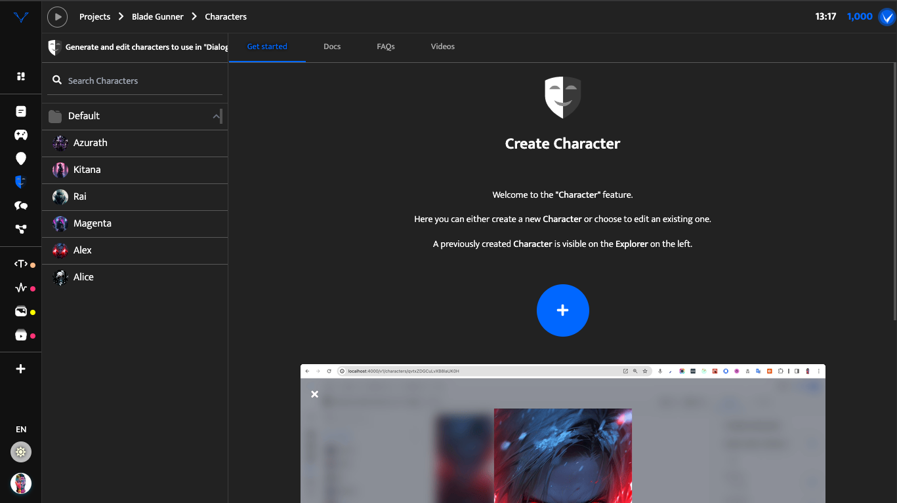
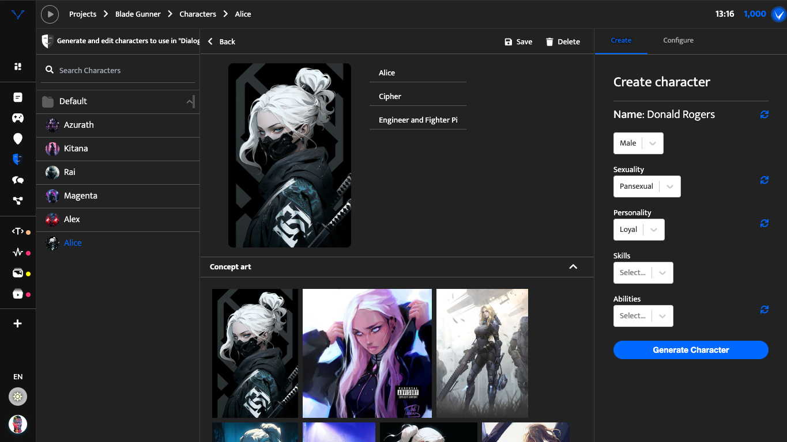

# Vision Studio


---

This is the React frontend web application of the Vision platform.

> Please note the [CODING_STANDARDS](./docs/CODING_STANDARDS.md) and [CONVENTIONS](./docs/CONVENTIONS.md)

## Quickstart

> NB: This project relies on `NodeJS` v16 and `yarn`

- `git clone {REPO_URL}`
- `cd ./vision-studio`
- `yarn`
- `yarn start`

## Security issues:
- https://beaglesecurity.com/free-website-security-assessment/results?url=https%3A%2F%2Fvision-studio.vercel.app%2F&hide_result=false

## System Overview

### Environments

### Frontend

| Environment | URL                                                                                  | Branch    |
| :---------- | :----------------------------------------------------------------------------------- | :-------- |
| **LOCAL**   | [https://localhost:4000](https://localhost:4000)                                     | *any*     |
| **DEV**     | [https://vision-studio-dev.vercel.app](https://vision-studio-dev.vercel.app)         | `develop` |
| **STAGING** | [https://vision-studio-staging.vercel.app](https://vision-studio-staging.vercel.app) | `staging` |
| **PROD**    | [https://vision-studio.vercel.app](https://vision-studio.vercel.app)                 | `master`  |

### Backend

| Environment | URL                                                                            | Branch    |
| :---------- | :----------------------------------------------------------------------------- | :-------- |
| **LOCAL**   | [https://localhost:8000](https://localhost:8000)                               | *any*     |
| **DEV**     | [https://vision-api-dev.vercel.app](https://vision-api-dev.vercel.app)         | `develop` |
| **STAGING** | [https://vision-api-staging.vercel.app](https://vision-api-staging.vercel.app) | `staging` |
| **PROD**    | [https://vision-api-prod.vercel.app](https://vision-api-prod.vercel.app)       | `master`  |

---

### System Diagram



### TechStack

| Name         | Icon                                                                                                              | Description                                                                      |
| :----------- | :---------------------------------------------------------------------------------------------------------------- | :------------------------------------------------------------------------------- |
| `React`      |        | Frontend library / ecosystem                                                     |
| `Redux`      |                                                                                                         | Application Store & State management (ReduxToolkit)                              |
| `Typescript` |  | Main Frontend & Backend Language (superset of Javascript)                        |
| `Javascript` |                                                                                                    | Used sparingly (e.g. simple NodeJS scripts...)                                   |
| `SASS`       |                                                                                                          | Superset of CSS                                                                  |
| `Tailwind`   |                                                                                                      | CSS Utility Framework                                                            |
| `Python`     |                                                                                                        | Python, used to run AI models, powered by [HuggingFace](https://huggingface.co/) |

#### Management

| Name       | Icon  | Description                                                                    |
| :--------- | :---- | :----------------------------------------------------------------------------- |
| `Firebase` |  | Backend as a service, used for `Auth`, `Firestore DB`                          |
| `Vercel`   |  | Used for Node.js project hosting (React WebApp and NodeJS Api, separate repos) |
| `Github`   |  | Superset of CSS                                                                |

<a href="https://www.typescriptlang.org/" target="_blank">
    
  </a>
### Project Structure



### Project Feature Navigation

There are various features, typically accessible via the sidebar tabs.

Features can be configured per project, and we also have featureFlags enabled to enable-disable a particular feature globally from a **s-erver**.



Features include, but are not limited to:

| Icon                                                                 | Name         | URL                                                              | Description                                                                         |
| :------------------------------------------------------------------- | :----------- | :--------------------------------------------------------------- | :---------------------------------------------------------------------------------- |
|   | `Documents`  | [/v1/documents](https://vision-studio.vercel.app/v1/documents)   | Write various documents for your project using a rich text editor and AI            |
|   | `Controls`   | [/v1/controls](https://vision-studio.vercel.app/v1/controls)     | Create control schemes for your gameplay                                            |
|  | `Characters` | [/v1/characters](https://vision-studio.vercel.app/v1/characters) | Create characters for your project, with the help of AI                             |
|   | `Locations`  | [/v1/locations](https://vision-studio.vercel.app/v1/locations)   | Define key locations in your game world                                             |
|   | `Dialogues`  | [/v1/dialogues](https://vision-studio.vercel.app/v1/dialogues)   | Conceptualise dialogues between characters in your game                             |
|     | `Graphs`     | [/v1/graphs](https://vision-studio.vercel.app/v1/graphs)         | Create flow diagrams for suitable aspects of games, branching quests or skill trees |

---

## Key Pages

Some of the Key pages to note for this application.

### Auth

---

The entry point to all customer created content. Each user has to log in to access their **Projects**. Currently supported Auth methods are shown on the `<Auth />` page.

> NB: The user can pick preferred `language` and `theme` from the AuthPage or when logged in.



---

### Projects

Everything created in this platform is associated with a project, that has a corresponding `projectId`.



---

### Dashboard

The Dashboard presents an overview of your entire project, with all the relevant resources just one click away.



---

## Feature Layout

The layout of most other pages presents a consistent interaction mechanism. This is achieved with the custom component `<SplitView />` that takes on several props to accomplish this.

### Layout without resource selection (Default)

---

`Characters` feature, for example:



### Layout with resource selection

---

`Characters` feature, for example:



An example of using the `<SplitView />` component, explained in more detail in the [CODING_STANDARDS](./docs/CODING_STANDARDS.md#vision-app-features):


```jsx
() => (
    <SplitView
      emptyView={
        // ... the default state of the view, with no resource selected
        // ... allows creating a new resource of the current type
      }
      exploreView={
        // ... the left side panel which allows searching resources
      }
      contentView={
        // ... the center panel that renders content fo ra selected resource
      }
      controlView={
        // ...
      }
      isShowingControls
    />
)
```


### -----


### Admin

- Dashboard
- Users
  - Admin Users
  - Customers
  - Leads
- Analytics
  - Usage metrics
  - Stats
- Legal
  - All legal documents
- Finances
  - Pricing
- Maintenance
  - Features
  - Pricing (Subscriptions)
  - Versions
    - Mobile App:
      - iOS version
      - Android version
    - Web App:
      - Version
      - Changelog?
- Marketing
  - Blog
  - Social Media
  - YouTube
  - Ad Networks
- Messaging
  - Notifications
  - Email
  - News
